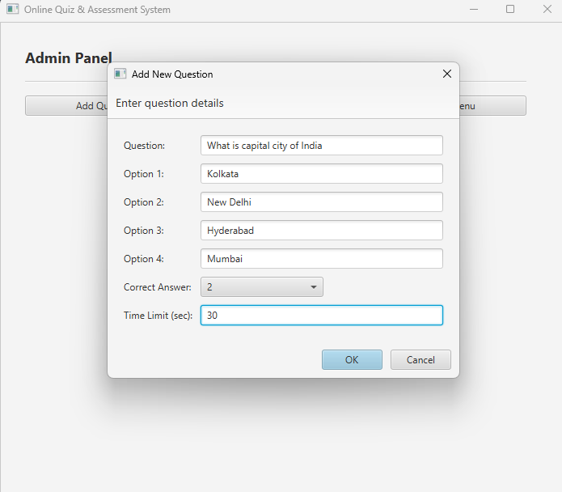
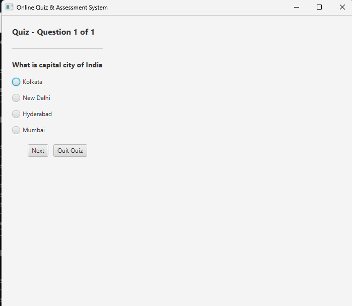

# Online Quiz and Assessment System

## Overview
Online Quiz and Assessment System is a modern quiz platform designed to help teachers and administrators create quizzes and students take them with an interactive graphical interface. The application features an intuitive system where administrators can add questions with multiple choice options, and students can take randomized quizzes with immediate scoring and feedback.

## What You Can Do With It

### For Administrators
- Add new quiz questions with four multiple-choice options
- Set the correct answer for each question
- Configure time limits for individual questions
- View all saved questions in a organized list
- Questions are automatically saved to a database file

### For Students
- Access the quiz from a user-friendly main menu
- Answer randomized questions (helps prevent cheating)
- Select answers using radio buttons
- Navigate through questions at your own pace
- See your final score and percentage after completing the quiz
- Try the quiz multiple times to improve your score

## Key Features
- Simple main menu with clear options
- Professional graphical interface built with JavaFX
- Admin panel to manage questions
- Interactive quiz interface with visual feedback
- Automatic score calculation
- Results page showing your performance
- Questions stored in a file database (quiz_questions.db)
- No complicated setup or configuration needed

## How The Application Works

### First Time Using It: Admin Setup
1. Launch the application
2. Click "Admin Panel" from the main menu
3. Click "Add Question"
4. Fill in the question details:
   - The question text
   - Four possible answers
   - Which answer is correct
   - Time limit (defaults to 20 seconds if you're not sure)
5. Click OK and your question is saved
6. Add as many questions as you want

### Taking a Quiz: Student Experience
1. Launch the application
2. Click "Take Quiz" from the main menu
3. You'll see questions one at a time
4. Select your answer by clicking the radio button
5. Click "Next" to go to the next question
6. After answering all questions, you'll see your results
7. Results show your score, total questions, and percentage

### Viewing Saved Questions: Admin
1. Click "Admin Panel"
2. Click "View Questions"
3. You'll see a list of all the questions you've created
4. Each question shows all four options and marks which one is correct

## What You Need To Run This

### Requirements
- Java Development Kit (JDK) 21 or later installed on your computer
- JavaFX SDK 21.0.2 (the graphical framework)

### Installation Steps

**Step 1: Download JavaFX**
- Go to https://gluonhq.com/products/javafx/
- Download JavaFX SDK 21.0.2
- Extract it to a folder: `C:\Program Files\Java\javafx-sdk-21.0.2`

**Step 2: Compile the Application**
Open your terminal/command prompt in the project folder and run:

```bash
javac --module-path "C:\Program Files\Java\javafx-sdk-21.0.2\lib" --add-modules javafx.controls,javafx.fxml OnlineQuizSystemGUI.java
```

**Step 3: Run the Application**
```bash
java --module-path "C:\Program Files\Java\javafx-sdk-21.0.2\lib" --add-modules javafx.controls,javafx.fxml OnlineQuizSystemGUI
```

## Using Batch Files (Easy Method)
Instead of typing long commands, create two files:

**compile.bat:**
```batch
@echo off
javac --module-path "C:\Program Files\Java\javafx-sdk-21.0.2\lib" --add-modules javafx.controls,javafx.fxml OnlineQuizSystemGUI.java
```

**run.bat:**
```batch
@echo off
java --module-path "C:\Program Files\Java\javafx-sdk-21.0.2\lib" --add-modules javafx.controls,javafx.fxml OnlineQuizSystemGUI
```

Then simply double-click or run:
```bash
compile.bat
run.bat
```

## Understanding The Interface

### Main Menu Screen
The first screen you see has three buttons:
- Admin Panel - For teachers and administrators to create questions
- Take Quiz - For students to answer questions
- Exit - Close the application

### Admin Panel
This screen has three options:
- Add Question - Opens a dialog to create a new quiz question
- View Questions - Shows all saved questions in a scrollable list
- Back - Returns to the main menu

### Add Question Dialog
A form where you enter:
- Question text (the actual question to ask)
- Option 1, 2, 3, 4 (the four possible answers)
- Correct option number (which option is the right answer)
- Time limit in seconds (optional, defaults to 20)

### Quiz Screen
Shows:
- Question number (like "Question 1 of 5")
- The full question text
- Four radio buttons with answer options
- Next button to proceed
- Quit button to exit and go back to menu

### Results Screen
After completing the quiz, you see:
- "Quiz Completed!" heading
- Your score (example: "Your Score: 8 / 10")
- Your percentage (example: "Percentage: 80.0%")
- Button to return to main menu

## How Questions Are Stored
Questions are automatically saved to a file called `quiz_questions.db` in your project folder. Each question is stored in a format that the application can read, so you can close and reopen the application without losing your questions.

## Technical Information For Developers
This application demonstrates several important software design concepts:

**Object-Oriented Programming** - The Question class stores all information about each quiz question in an organized way.

**User Interface Design** - JavaFX is used to create windows, buttons, dialogs, and layouts that are responsive and professional-looking.

**Data Persistence** - Questions are saved to and loaded from a file, so data survives even after you close the application.

**Event Handling** - Every button click and user interaction is handled by the application to perform the correct action.

**Collections and Lists** - Java's ArrayList is used to manage multiple questions efficiently.

##Screenshots
Admin panel:


Student Panel:

