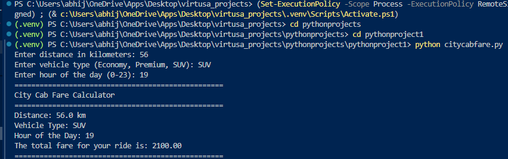

# City Cab Fare Calculator

## Overview
This project is a simple Python console application that calculates cab fare based on:
- distance traveled in kilometers
- selected vehicle type
- time of day

It also applies surge pricing during peak hours.

## Features
- Supports `Economy`, `Premium`, and `SUV` ride types
- Calculates fare using per-kilometer pricing
- Applies surge pricing between `17:00` and `20:00`
- Validates distance, vehicle type, and hour input
- Runs as a lightweight command-line program

## Tools Used
- Python 3
- Python built-in data structures: dictionaries, functions, conditionals
- Python exception handling with `try` / `except`
- Console input/output using `input()` and `print()`

## File
- `citycabfare.py` - main fare calculation script

## How to Run
```bash
python citycabfare.py
```

## Sample Use Case
Enter:
- Distance: `10`
- Vehicle Type: `Premium`
- Hour: `18`

The program calculates the fare using the premium rate and surge multiplier.

## Screenshots
Place your screenshots inside the `screenshots` folder and embed them like this:

```md

```

